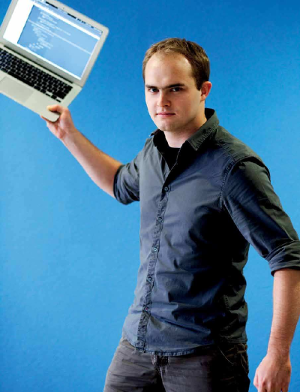



	
	(Photo by Duncan de Fey)

I am Wouter Geraedts, a graduate student at the [Radboud University Nijmegen](http://www.ru.nl/), in The Netherlands. I am currently working to get my master's degree in the [Mathematical Foundations of Computing Science (MFoCS)](http://www.ru.nl/masters/programme/science/mathematics/specialisations/foundations/). Professionally I have worked on several websites and mailing systems. Currently I am working on several concepts involving (web)scrapers.

# Personal

I am an active [climber](http://www.youtube.com/watch?v=0AtMapdKt3g) and swimmer (almost for free thanks to the [USC](http://www.ru.nl/sportcentrum/)). I also love to read (fantasy) books, and am a fan of Robin Hobb's and Robert Jordan's work. My [list](http://myanimelist.net/animelist/Wassasin) of watched anime-series is extensive. Sometimes I can be found [livestreaming](http://twitch.tv/Wassasin) a game. Finally, I am a member of the student sect [#RU](http://hashru.nl). But nothing beats my primary hobby: developing software.

# Work

As a full-time student, I am currently not looking for new work. In the past I've held the following positions:

* 2014 Studentassistant for the course Algorithms and Datastructures at the Radboud University
* 2014 Studentassistant for the course Complexity at the Radboud University
* 2010-2013 Studentmember of the education committee at the Radboud University
* 2010, 2011, 2013 Studentassistant for the course Processen at the Radboud University
* 2010, 2011 Studentassistant for the course Processoren at the Radboud University
* 2007-2011 Programmer at Adecon

For a list of my current and past projects, see the [projects](projects.html) page.

# Skills

From both personal and professional experience, I can give the following list of proficiencies:

* Working proficiency: SVN, Git, Python, Java, JavaScript, LLVM, OCaml, Coq
* Teaching proficiency: MySQL, HTML, PHP, Haskell, C, C++, C#, LaTeX, UPPAAL, (Web)scraping

# Awards

* I received the [Aia Bachelor Award](http://www.aiasoftware.com/index.php/en/press-releases/braille-in-mathematics-and-the-modeling-of-flow-systems/) for my bachelor's thesis on 'Time-based Modeling and Verification of Flow Systems in Uppaal'.

# PGP key
I might send you some e-mail with a so-called PGP-block (i.e. BEGIN PGP SIGNED MESSAGE). If you don't understand what this is: ignore it. Otherwise, here is the fingerprint of my PGP key:

	FA23 575C 5235 BF54 E6B5 C5C8 4145 4BB1 EA68 26AF
